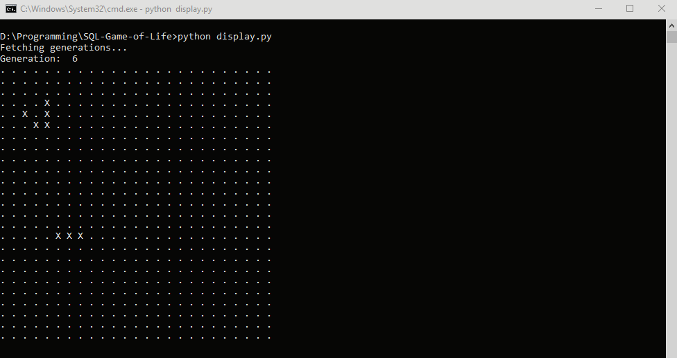

# SQL-Game-of-Life
Conway's Game of Life computed with TSQL and animated in console with a bit of Python.

This runs like complete trash, but performance wasn't the point.
I just wanted to see if I could get a glider to go across the screen using nothing but SQL generated data.

**display.py** executes the stored procedure within **Game-of-Life.sql** to generate generations of Game of Life
and animate the results.

## References
* Curses module https://www.devdungeon.com/content/curses-windows-python
* http://www.paleotechnologist.net/wp-content/uploads/2010/10/glider.png
* Conway's Game of Life https://en.wikipedia.org/wiki/Conway%27s_Game_of_Life
* Python test implementation https://nostarch.com/download/samples/PythonPlayground_sampleCh3.pdf
